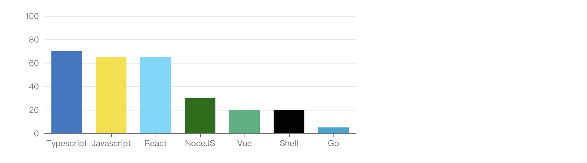

### Hi there 👋👋👋👋👋

 :books: I want to learn <a href="https://go.dev/" target="_blank"></a>  

### Skills


<br />

[](https://github.com/xzdry)

### leetcode
[](https://leetcode.cn/u/xzdry-2/)

### wakatime
<!--START_SECTION:waka-->

```text
Total Time: 29 hrs 2 mins

TypeScript       22 hrs 26 mins  ███████████████████▒░░░░░   77.22 %
XML              1 hr 24 mins    █▒░░░░░░░░░░░░░░░░░░░░░░░   04.82 %
JSON             1 hr 13 mins    █░░░░░░░░░░░░░░░░░░░░░░░░   04.19 %
CoffeeScript     1 hr 5 mins     █░░░░░░░░░░░░░░░░░░░░░░░░   03.76 %
Markdown         56 mins         ▓░░░░░░░░░░░░░░░░░░░░░░░░   03.23 %
JavaScript       46 mins         ▓░░░░░░░░░░░░░░░░░░░░░░░░   02.69 %
```

<!--END_SECTION:waka-->

### blog posts
[xzdry's realm](https://www.justdry.net/)
